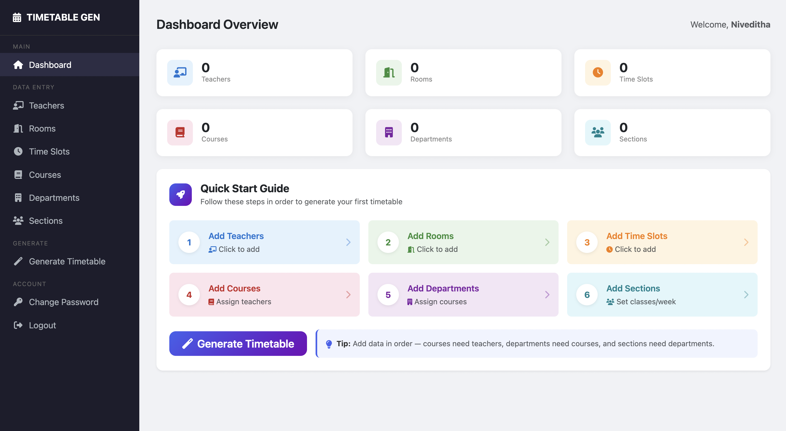
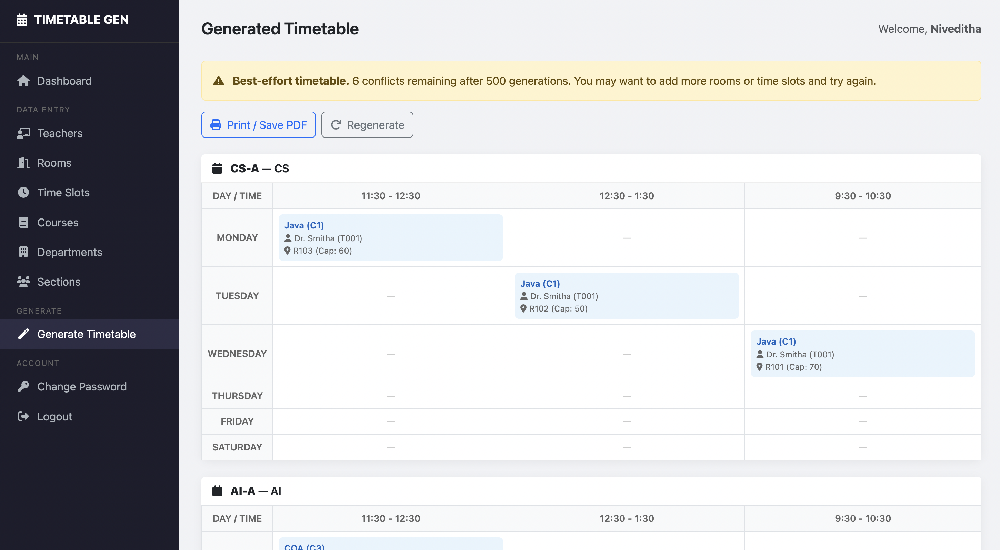

# College Timetable Generation System

A web application that automatically generates conflict-free class timetables for colleges and universities using a **Genetic Algorithm**, built with Django and SQLite.

---

## Features

- **Genetic Algorithm** — Evolves timetable candidates over generations to find optimal, conflict-free schedules
- **Hard Constraint Enforcement** — No room double-booking, no teacher conflicts, no section overlaps, room capacity validation
- **Modern Dashboard** — Clean sidebar-based UI with Bootstrap 5.3 for data entry and management
- **CRUD Management** — Add, view, and delete teachers, rooms, time slots, courses, departments, and sections
- **Timetable Grid View** — Generated timetable displayed in a day × time grid per section
- **PDF Export** — Print or save the timetable as PDF via browser print
- **Authentication** — User registration, login, logout, and password change

---

## Tech Stack

| Technology | Purpose |
|---|---|
| Python 3.10+ | Backend language |
| Django 4.2 | Web framework |
| SQLite | Database |
| Bootstrap 5.3 | Frontend UI |
| Genetic Algorithm | Timetable optimization |

---

## Project Structure

```
College-Timetable-generation-system/
├── manage.py                 # Django CLI entry point
├── requirements.txt          # Python dependencies
├── config/                   # Django project settings
│   ├── settings.py
│   ├── urls.py
│   ├── wsgi.py
│   └── asgi.py
├── scheduler/                # Main app — timetable generation
│   ├── models.py             # Data models (Room, Instructor, Course, etc.)
│   ├── algorithm.py          # Genetic Algorithm engine
│   ├── views.py              # View functions
│   ├── urls.py               # URL routing
│   ├── forms.py              # Django model forms
│   └── admin.py              # Admin registrations
├── accounts/                 # Authentication app
│   ├── views.py              # Login / register views
│   ├── forms1.py             # Auth forms
│   └── templates/            # Auth templates (login, register, etc.)
└── templates/                # Shared templates
    ├── base.html             # Public page base
    ├── index.html            # Landing page
    ├── about.html            # About page
    ├── help.html             # Help / guide page
    └── dashboard/            # Dashboard templates
        ├── base_dashboard.html
        ├── home.html
        ├── generate.html
        ├── timetable_result.html
        └── (CRUD templates for each entity)
```
---

## How to Run

### Prerequisites
- Python 3.10 or higher
- pip

### Setup

```bash
# 1. Clone the repository
git clone https://github.com/marvelcodeX/College-Timetable-generation-system.git
cd College-Timetable-generation-system

# 2. Create and activate a virtual environment
python -m venv venv
# On Windows:
venv\Scripts\activate
# On macOS/Linux:
source venv/bin/activate

# 3. Install dependencies
pip install -r requirements.txt

# 4. Run migrations
python manage.py migrate

# 5. Create a superuser (for admin access)
python manage.py createsuperuser

# 6. Start the development server
python manage.py runserver

# 7. Open http://127.0.0.1:8000/ in your browser
```
---

## How to Use

1. **Register/Login** — Create an account or login
2. **Add Teachers** — Enter teacher IDs and names
3. **Add Rooms** — Enter room numbers and seating capacities
4. **Add Time Slots** — Define day + time combinations (e.g., Monday 9:30-10:30)
5. **Add Courses** — Create courses and assign teacher(s)
6. **Add Departments** — Group courses into departments
7. **Add Sections** — Create student sections, assign to departments, set classes per week
8. **Generate** — Click "Generate Timetable" and view the conflict-free result

---

## Genetic Algorithm Details

The algorithm uses the following approach:

| Parameter | Value |
|---|---|
| Population Size | 25 |
| Max Generations | 500 |
| Elite Count | 2 |
| Tournament Size | 5 |
| Mutation Rate | 10% |
| Crossover Rate | 85% |

**Fitness Function**: `1 / (1 + number_of_conflicts)`

A fitness of 1.0 means zero conflicts (perfect timetable).

---

## Demo Images

| | |
|---|---|
|  |  |

---
## Suggested Improvements

- [ ] **Edit functionality** — Allow editing existing records (currently only add/delete)
- [ ] **Instructor preferences** — Allow teachers to set preferred/unavailable time slots
- [ ] **Lab sessions** — Support for multi-hour lab blocks
- [ ] **Multiple timetable versions** — Save and compare different generated timetables
- [ ] **Room type constraints** — Distinguish between lecture halls, labs, seminar rooms
- [ ] **Conflict visualization** — Highlight specific conflicts when a perfect solution isn't found

---

## Credits

This project is based on the original work by [abhayshah0305/TimetableGenerationSystem](https://github.com/abhayshah0305/TimetableGenerationSystem).

Modified, restructured, and improved with a proper genetic algorithm, modern UI, and clean code architecture.
